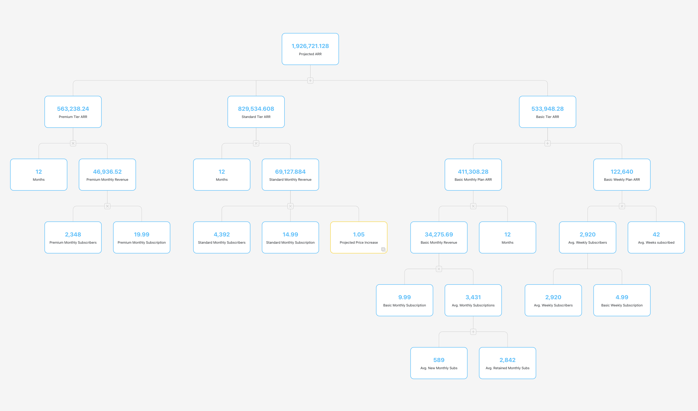

# Bonsai

*Note: while I plan to give this project an MIT license, it is currently pending approval from the
copyright owner(s) so anyone seeking to use this software, especially for commercial purposes, should
refer to the <a href="https://policies.unc.edu/TDClient/2833/Portal/KB/ArticleDet?ID=132138"
target="_blank">policies published by UNC</a> and reach out to them or Dr. Walker directly to help request
open source licensing for this project.*

## General Tree Positioning

Bonsai is a tree positioning utility that can compute coordinates for all nodes in a given tree such
that they are neatly spaced out when displayed visually. The impetus for this project was a
web application with a specific use-case involving the dynamic rendering of an interactive tree.
It was crucial for that application to recompute and update the node positions automatically
after each change. For a full description of that project, including a demo GIF of the tree in action,
check out my portfolio post on the [Bonsai Metric Tree](https://terryliu.com/portfolio/bonsai) project.

Any application that involves displaying a well-spaced tree structure may benefit, especially in cases
where the tree changes in shape often enough to make it cumbersome or impossible to reposition manually.
Note that this project is only the backend algorithm used for position calculations and it does not
handle anything to do with actually displaying the tree other than providing coordinates as output.
Still, it may be easier to grok with a visual example, so below is a screenshot of how the first
use-case looked when rendered. See the aforementioned portfolio for more details.

## Walker Node Positioning Algorithm

The core of this project is an implementation of John Q. Walker II's node-positioning algorithm for
general trees with some adjustments, additional methods, and wrapper layers to provide a better user
interface. It is a recursive algorithm but for reasonably-sized trees, node placements are
recalculated quickly enough to support instant re-rendering of the tree upon adding or removing
nodes.

Included is the original report that describes the algorithm, provided by the University of North
Carolina:\
<a href="docs/89-034.pdf" target="_blank">A Node-Positioning Algorithm for General Trees</a>

Note: there are select comments marked specifically with `NB` (nota bene), which call to attention
parts of the algorithm that differ from the original specification because something did not work as
expected without those changes. The majority of the internal logic (`_walker_tree.py`) should
otherwise be largely as prescribed in the report.
